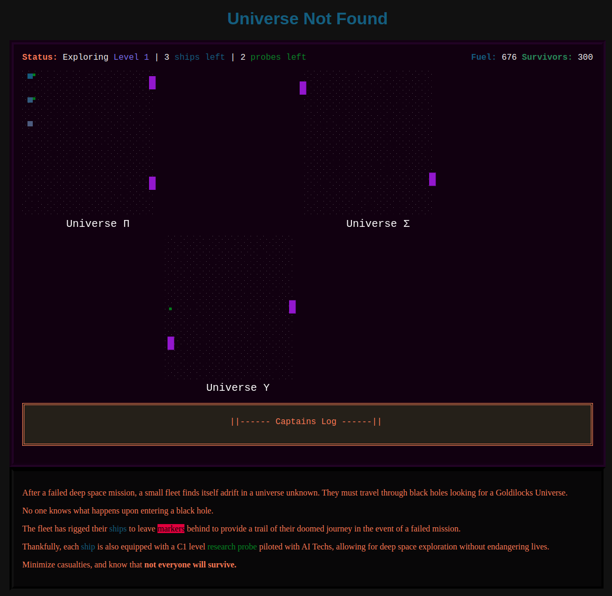

# js13k game: Universe Not Found
Universe Not Found: An HTML5 + Canvas Game for js13k 2020

For the [js13k game challenge](https://js13kgames.com/) as part of the 2020 competition.

## Gameplay
This game is a memory-game mixed with puzzle exploration game, where black holes transport your ship to new universes on a trek to find a place to call home.

## Current Version
v0.1.0

## Demo
[Link](https://cameronmanavian.com/js13k-game-universe-not-found/)

## Platforms / Technologies
* [JavaScript] Primary language for this project 🚀
* [Node.js] a JavaScript runtime built on Chrome's V8 JavaScript engine 🏎️
* [TypeScript] to reduce the need for debugging or testing for a game challenge 💜
* [ESLint] to maintain a consistent code style in JavaScript 🤝
* [Canvas] to create a 2D context for the game ⚡
* [webpack] to help keep this project under the required 13kb  📦
* [OscillatorNode] for fancy space music and sound effects 🎶 - via [TinyMusic] (Thanks to Kevin Ennis)

[ESLint]: http://eslint.org
[TypeScript]: https://typescriptlang.org/
[TinyMusic]: https://github.com/kevincennis/TinyMusic
[JavaScript]: http://en.wikipedia.org/wiki/JavaScript
[Node.js]: https://nodejs.org/en/
[Canvas]: https://developer.mozilla.org/en-US/docs/Web/API/Canvas_API
[webpack]: https://webpack.js.org/
[OscillatorNode]: https://developer.mozilla.org/en-US/docs/Web/API/OscillatorNode
